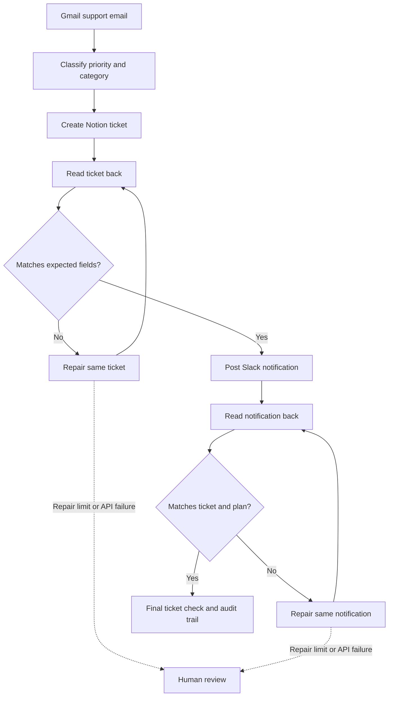

# Support Sentinel

**Support intake that checks its own work.**

Support Sentinel turns a Gmail support request into a Notion ticket and a Slack notification, then reads both back to verify the result. When stored details disagree with the intake plan, it attempts a repair. If verification cannot succeed, it stops for human review.

> Verified intake is not a resolved customer issue. Tickets remain open for the support team.

## How it works



Each verification stage permits up to two repairs per run. API errors stop the workflow for review.

## Features

- **Three real integrations:** Gmail for intake, Notion for tracking, Slack for notifications.
- **Read-back verification:** compares expected fields with data retrieved from the apps, rather than trusting a successful write response.
- **Bounded repair:** updates the existing ticket or notification and checks again.
- **Duplicate protection:** persists source IDs and provider IDs in SQLite for reuse across runs and restarts.
- **Evidence trail:** timestamped checks, mismatches, repairs, and downloadable audit JSON.
- **Inbox watcher:** polls every minute for new inbox emails whose subject contains `Support Sentinel test`.
- **Credential-free demo:** simulated success, incorrect priority, incomplete notification, and persistent failure scenarios.
- **Optional AI triage:** OpenAI structured outputs can classify manually submitted intakes. Rules are the default; the watcher currently uses rules only.

## Project status

This is a local hackathon prototype. A real Gmail → Notion → Slack happy-path intake has been exercised and verified. The automated suite covers repair and failure behavior using isolated local state and mocked providers.

**Live failure injection is not implemented.** The selectable failure scenarios run only against simulated apps. Do not present those scenarios as real provider failures. AI triage is implemented as an option but was not used in the demonstrated live run.

## Quick start: no accounts required

Use Python 3.10 or newer. The default demo uses the Python standard library only.

```sh
# From the repository folder
python server.py
```

Open **http://127.0.0.1:8765/**, keep **Demo** selected, and click **Run verified intake**.

On Windows, `start.ps1` prefers the project virtual environment, then a Codex bundled Python runtime if available, and finally the system Python. From Command Prompt, use `python server.py` directly; `.ps1` launchers are PowerShell scripts.

## Connect the real apps

Copy `.env.example` to `.env`. Enter credentials locally and restart the server after changing them. Keep `.env`, OAuth credentials, tokens, logs, and the `data/` folder out of Git; the included ignore rules cover them.

### 1. Gmail

1. Create a Google Cloud project and enable Gmail API.
2. Configure OAuth consent. For a personal Gmail account, use an External audience in Testing and add your Gmail address as a test user.
3. Create a **Desktop app** OAuth client and download its JSON as `credentials.json` in the project root.
4. Install the optional Gmail sign-in dependencies in a virtual environment:

```sh
python -m venv .venv
```

Windows Command Prompt:

```bat
.venv\Scripts\python.exe -m pip install -r requirements-gmail.txt
.venv\Scripts\python.exe gmail_auth.py
.venv\Scripts\python.exe server.py
```

macOS / Linux:

```sh
.venv/bin/python -m pip install -r requirements-gmail.txt
.venv/bin/python gmail_auth.py
.venv/bin/python server.py
```

Complete Google sign-in and review the `gmail.readonly` permission. Authorization is stored in `data/gmail-token.json`; access tokens refresh automatically. If authorization expires or is revoked, run the sign-in helper again. A manually supplied `GMAIL_ACCESS_TOKEN` is supported when no saved OAuth token exists.

Gmail access is read-only: this app does not send replies, change labels, or mark mail as read. Inline plain-text and nested multipart messages are supported. HTML-only mail and attachments require review.

### 2. Notion

Create an internal connection using **Access token** authentication with read, insert, and update content capabilities. Create a **Support Tickets** database, then add the connection through the database page's **Connections** menu.

Use these property names and types exactly:

| Property | Notion type | Required options |
|---|---|---|
| Name | Title | — |
| Sender | Text | — |
| Source ID | Text | — |
| Reason | Text | — |
| Priority | Select | High, Medium, Low |
| Category | Select | Technical, Billing, General |
| Status | Select | Open |

`Status` must be a **Select**, not Notion's special Status property type. Extra options are fine.

Set `NOTION_TOKEN` and `NOTION_DATA_SOURCE_ID`. The data source ID is distinct from the database container ID. With API version `2025-09-03`, retrieve the database via `GET /v1/databases/{database_id}` and use the appropriate entry in its `data_sources` array. The adapter pins that API version.

### 3. Slack

1. Create a Slack app for your workspace.
2. In **OAuth & Permissions → Bot Token Scopes**, add `chat:write` and `channels:history` for a public channel. Use `groups:history` for private-channel read access.
3. Install the app to the workspace and save its bot token as `SLACK_BOT_TOKEN`.
4. Invite the bot to your chosen channel.
5. Set `SLACK_CHANNEL_ID` to that channel's ID.

The app posts a notification, retrieves the exact message by timestamp, and updates that same message when required. API errors and rate limits stop for review; automatic retry/backoff is not implemented.

### 4. Optional OpenAI triage

Set `OPENAI_API_KEY` and optionally `OPENAI_MODEL` (default `gpt-4o`, requiring Responses API structured-output support). Enable **Use OpenAI for triage** for a manual intake.

This sends the email content to OpenAI to select priority/category and explain the choice. Deterministic code controls writes, verification, and repair limits. Without this option, classification uses keyword rules and does not call an AI model. The automatic watcher uses rules regardless of the manual form checkbox.

### Environment variables

| Variable | Purpose |
|---|---|
| `NOTION_TOKEN` | Notion internal connection token |
| `NOTION_DATA_SOURCE_ID` | Destination Notion data source |
| `SLACK_BOT_TOKEN` | Installed Slack bot token |
| `SLACK_CHANNEL_ID` | Notification channel |
| `GMAIL_ACCESS_TOKEN` | Optional fallback instead of saved OAuth authorization |
| `OPENAI_API_KEY` | Optional AI classification |
| `OPENAI_MODEL` | Structured-output model; default `gpt-4o` |
| `PORT` | Local server port; default `8765` |

The dashboard's connection indicators report configuration presence, not a fresh authentication test.

## Run a live intake

1. Select **Live** in the app.
2. Enter a Gmail **API message ID**, not the RFC Message-ID header, and click **Load from Gmail**.
3. Review the email and enable the live-write checkbox.
4. Run the intake and inspect its evidence trail.

The server re-reads Gmail before acting. The resulting ticket remains **Open**. Existing source IDs reuse their saved provider IDs; changed content under the same ID is rejected.

## Watch incoming test emails automatically

Click **Start watching test emails** on the dashboard. It automatically creates tickets and posts notifications for matching new messages.

- Filter: inbox emails with `Support Sentinel test` in the subject.
- Interval: 60 seconds after the preceding poll completes. Network calls can add delay.
- First activation sets the start time: earlier emails are excluded.
- Pausing retains that start time. Matching emails received during a pause can be processed after resuming.
- Messages must remain in the inbox until polled.
- Completed messages are not repeatedly processed or continuously checked for future changes.
- Each message is attempted once by the watcher. An error pauses it and provides a review notice.
- Settings and processed IDs persist in SQLite. An enabled watcher resumes when the server restarts.

The computer must stay awake and online with the server running. This is not a cloud service or a system-startup task. Requests from the dashboard and watcher are serialized within one server process, so a poll can briefly delay the UI.

Example test email:

```text
Subject: Support Sentinel test — cannot log in

Hi Support,
This is a demo test. Our entire team cannot log in to the
production dashboard, and customer operations are blocked.
Please investigate.
Thanks,
Alex
```

Expected rule-based classification: **High / Technical / Open**.

## Demo and evaluation

Use [DEMO-SCRIPT.md](DEMO-SCRIPT.md) for a two-minute walkthrough.

| Case | Expected outcome | Evidence |
|---|---|---|
| Happy path | Verified intake | Ticket fields and notification read back successfully |
| Wrong priority (simulation) | Same ticket repaired | Expected High vs actual Low, followed by matching read-back |
| Incomplete notification (simulation) | Same message repaired | Expected vs actual message text |
| Persistent failure (simulation) | Human review | Two repairs, then stop before notification |
| Same source processed twice | IDs reused | Same ticket/message IDs, no additional local demo objects |
| Create accepted but response lost | Recreation blocked | Durable uncertain-create marker |
| New matching inbox email | Automatic live intake | Watcher status and saved run |

Run the tests with the project interpreter:

```sh
python -m unittest -v
```

The current suite contains **21 tests**: workflow verification and repair, duplicate handling, restart persistence, uncertain outcomes, input validation, drift detection, mention escaping, Gmail parsing, mocked AI output/refusal, and watcher filtering, pagination, pause behavior, and duplicate prevention. Tests do not send live notifications.

## Architecture

| File | Responsibility |
|---|---|
| `agent.py` | Rules/AI triage, provider adapters, SQLite store, verification loop |
| `gmail_auth.py` | Desktop OAuth login and refresh |
| `watcher.py` | Filtered inbox polling and durable attempt tracking |
| `server.py` | Local HTTP API, static UI, request checks, serialized polling |
| `static/` | Dashboard, run history, evidence display, audit export |
| `test_agent.py` | Intake and verification tests |
| `test_watcher.py` | Polling and watcher tests |
| `.env.example` | Empty configuration template |

## Reliability boundaries

- Run **one server process and one mailbox per local database**. There is no distributed lock or provider-side uniqueness constraint. Keep the SQLite database; deleting it loses duplicate protection.
- A creation intent is saved before sending a write. If its outcome is uncertain, automatic recreation is blocked. Recovery currently requires inspecting the provider and reconciling the local record; there is no recovery UI.
- Re-running an existing live intake can restore its original planned properties. Use a dedicated test database/channel while evaluating.
- Verification proves consistency with the saved plan at the time of the check. It does not prove correct classification, resolution of the customer problem, or future consistency.
- Email-derived data and authorization are stored locally. The localhost server is a single-user prototype and is not designed for public hosting.

## Troubleshooting

| Problem | Check |
|---|---|
| Email never appears in Notion/Slack | Watcher enabled? New after first activation? Subject matches? Still in inbox? |
| Watcher paused | Read its error and the latest intake audit; resolve the cause before resuming |
| Gmail sign-in blocked | Correct OAuth test user and Desktop app credentials; reconnect if authorization expired |
| Notion 404 | Connection shared with database and correct data source ID |
| Slack `not_in_channel` | Invite the installed bot to the configured channel |
| Slack `missing_scope` | Add the required bot scope and reinstall the app |
| Port already in use | Stop the existing local server or set another `PORT` |
| PowerShell script opens in an editor | Use PowerShell or run the Python command directly in Command Prompt |

## Next improvements

- Controlled, clearly labeled real-provider failure demonstrations.
- Human-review and uncertain-write recovery UI.
- Watcher support for optional AI triage and dedicated support labels.
- Broader HTML email support and measured classification evaluations.
- Production deployment, stronger concurrency protection, and operational monitoring.

## References

- [Gmail Python OAuth quickstart](https://developers.google.com/workspace/gmail/api/quickstart/python)
- [Gmail search and filtering](https://developers.google.com/workspace/gmail/api/guides/filtering)
- [Notion create page](https://developers.notion.com/reference/post-page)
- [Slack posting messages](https://docs.slack.dev/reference/methods/chat.postMessage/)
- [Slack reading message history](https://docs.slack.dev/reference/methods/conversations.history/)
- [OpenAI structured outputs](https://developers.openai.com/api/docs/guides/structured-outputs)
