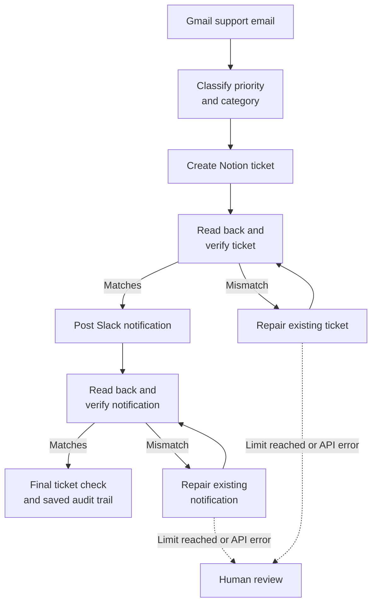
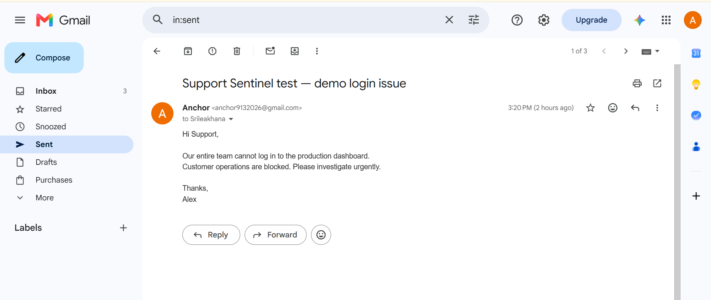
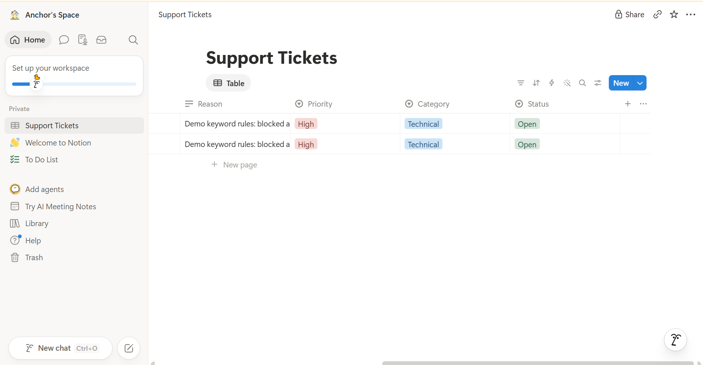
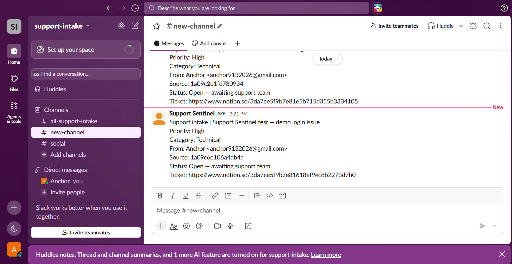
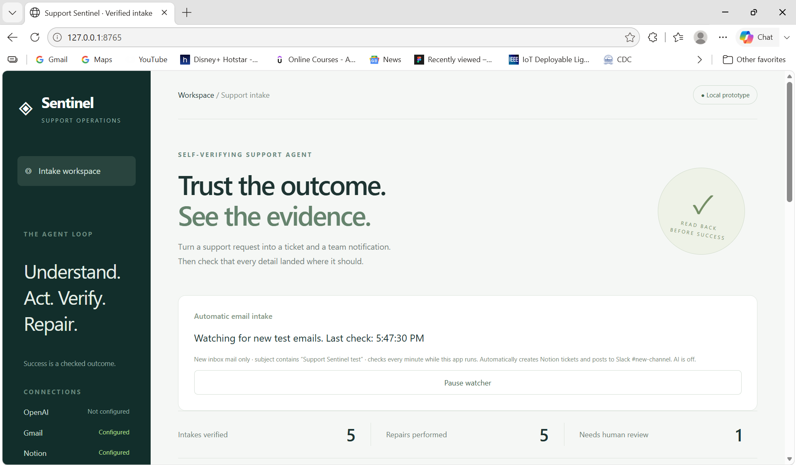
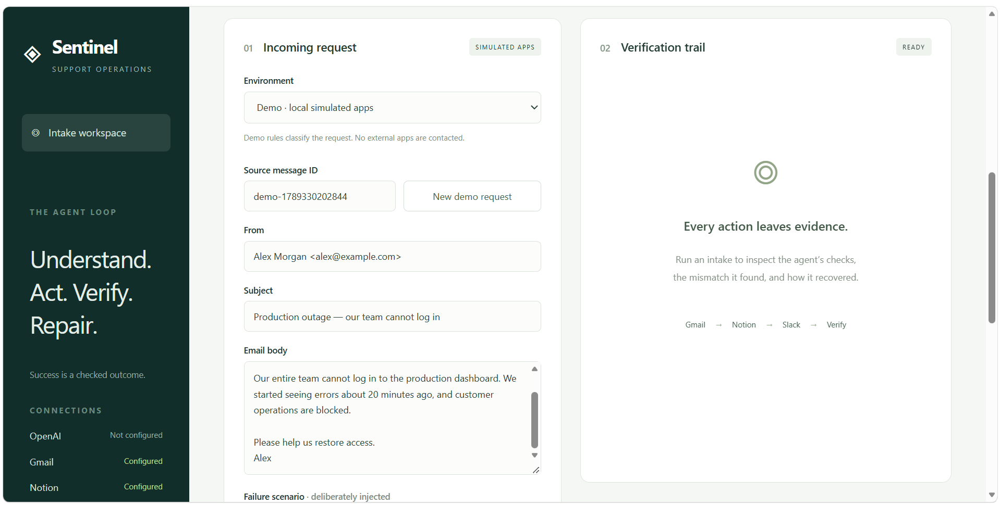
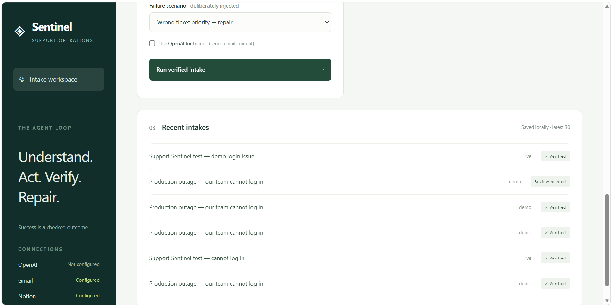

# Support Sentinel

## Project overview

Support Sentinel is a self-verifying support intake application. It reads a support email from Gmail, creates a Notion ticket, and posts a Slack notification. It then retrieves the saved ticket and notification to check that their details match the expected result.

When a mismatch is detected, the application attempts to repair the existing record. Each verification stage allows up to two repair attempts per run. Persistent mismatches and provider errors stop the process for human review. A verified intake means the request was recorded correctly; the customer's underlying issue remains open.



The application includes a local dashboard, SQLite persistence, downloadable audit trails, and an inbox watcher. The watcher checks every minute for new inbox emails containing `Support Sentinel test` in the subject. It runs while the local server is running and the computer is awake and online.

Classification uses keyword rules by default. Optional AI triage is available for manual intakes; the watcher currently uses rules only. A real Gmail → Notion → Slack happy-path intake has been verified. Failure-injection scenarios currently use simulated apps, not live provider failures.

## External apps

| App | Purpose | Required access |
|---|---|---|
| Gmail | Read incoming support requests | OAuth `gmail.readonly` |
| Notion | Create, retrieve, and repair support tickets | Internal connection with read, insert, and update content access |
| Slack | Post, retrieve, and repair team notifications | Bot scopes `chat:write` and `channels:history` for a public channel |
| OpenAI API (optional) | Classify priority/category and explain the choice for manual intakes | API key and a model supporting Responses API structured outputs |

## Setup instructions

### Run the local demo

Install Python 3.10 or newer. From the repository folder, run:

```sh
python server.py
```

Open **http://127.0.0.1:8765/**. Keep **Demo** selected and leave AI triage unchecked. This mode needs no credentials or third-party Python packages.

### Configure live integrations

Copy `.env.example` to `.env` and fill in the appropriate values locally:

```dotenv
NOTION_TOKEN=
NOTION_DATA_SOURCE_ID=
SLACK_BOT_TOKEN=
SLACK_CHANNEL_ID=
OPENAI_API_KEY=
OPENAI_MODEL=gpt-4o
PORT=8765
```

OpenAI configuration is optional. Credentials, OAuth tokens, logs, and local databases are excluded by `.gitignore`; do not commit them. Restart the server after changing configuration.

**Gmail**

1. Create a Google Cloud project and enable Gmail API.
2. Configure OAuth consent. For a personal Gmail account, choose External, keep the app in Testing, and add your Gmail address as a test user.
3. Create a Desktop app OAuth client. Save its downloaded JSON as `credentials.json` in the project root.
4. Create a virtual environment and install the Gmail login dependencies:

```sh
python -m venv .venv
```

Windows Command Prompt:

```bat
.venv\Scripts\python.exe -m pip install -r requirements-gmail.txt
.venv\Scripts\python.exe gmail_auth.py
.venv\Scripts\python.exe server.py
```

macOS / Linux:

```sh
.venv/bin/python -m pip install -r requirements-gmail.txt
.venv/bin/python gmail_auth.py
.venv/bin/python server.py
```

Complete Google sign-in and approve read-only access. Tokens are stored in `data/gmail-token.json` and refreshed automatically. If authorization expires or is revoked, run the sign-in helper again. `GMAIL_ACCESS_TOKEN` is an optional manual fallback when no saved OAuth token exists.

**Notion**

Create an internal connection using Access token authentication, enable read/insert/update capabilities, and add it to a database named **Support Tickets** using the database's Connections menu.

Create these exact properties:

| Property | Type | Options |
|---|---|---|
| Name | Title | — |
| Sender | Text | — |
| Source ID | Text | — |
| Reason | Text | — |
| Priority | Select | High, Medium, Low |
| Category | Select | Technical, Billing, General |
| Status | Select | Open |

Use Select for Status, not Notion's special Status property type. Set `NOTION_TOKEN` and `NOTION_DATA_SOURCE_ID`. The data source ID differs from the database container ID: retrieve the database through `GET /v1/databases/{database_id}` using Notion API version `2025-09-03`, then select its appropriate `data_sources` entry.

**Slack**

1. Create a Slack app for your workspace.
2. Under OAuth & Permissions → Bot Token Scopes, add `chat:write` and `channels:history`. For a private channel, use `groups:history` for read access.
3. Install the app and save its bot token as `SLACK_BOT_TOKEN`.
4. Invite the bot to the destination channel and save its ID as `SLACK_CHANNEL_ID`.

**Optional AI triage**

Set `OPENAI_API_KEY`, choose a compatible `OPENAI_MODEL`, and enable **Use OpenAI for triage** for a manual intake. This sends email content to OpenAI. The default classification and the automatic watcher do not use an AI model.

### Process email

For a manual intake, select **Live**, enter a Gmail API message ID, click **Load from Gmail**, review the email, enable the live-write checkbox, and run the intake. The API message ID is different from the RFC Message-ID header.

For automatic intake, click **Start watching test emails**. The first activation excludes earlier emails. Pausing retains the original start time, so matching mail received during a pause may be processed after resuming. Messages must remain in the inbox until checked. A failed intake pauses the watcher for review; processed messages are not repeatedly retried. Enabled monitoring resumes when the server restarts.

Keep one server process and one mailbox per local database. Gmail reading supports inline plain-text and nested multipart messages; HTML-only mail and attachments require review. The server is a local prototype, not a public hosting service.

## Reliability testing

Run the automated suite with the Python interpreter used for the application:

```sh
python -m unittest -v
```

The current suite contains **21 tests**. It uses isolated local state and mocked provider responses, with no live messages sent by tests.

| Test area | What is checked |
|---|---|
| Successful intake | Ticket and notification are read back; the customer ticket remains Open |
| Incorrect ticket priority | The mismatch is detected and the same ticket is repaired |
| Incomplete notification | The existing message is corrected and verified |
| Persistent mismatch | Two repair attempts are followed by human review |
| Duplicate processing | Repeated source IDs reuse ticket and message IDs |
| Restart persistence | Saved IDs remain usable after reopening the database |
| Uncertain create result | Automatic recreation is blocked after a potentially accepted write |
| Input and source conflicts | Empty inputs and changed content under an existing source ID are rejected |
| Ticket changes during processing | The final read detects drift |
| Slack mention handling | Email content cannot inject Slack mention syntax |
| Gmail parsing | Nested plain-text email bodies are decoded |
| Optional AI response handling | Structured output is accepted and unusable/refused output stops intake |
| Watcher behavior | Disabled state, subject filtering, duplicate prevention, pagination, pause-on-failure, and restart-time retention |

A separate live test successfully read an actual Gmail message, created a Notion ticket, posted its Slack notification, and verified both through their APIs. The selectable incorrect-priority, incomplete-notification, and persistent-failure demos are simulations; live failure injection has not been implemented.

SQLite stores provider IDs, expected fields, timestamps, and verification evidence. A durable creation marker prevents blind retries after an uncertain write. Such cases currently require manual reconciliation; there is no recovery interface. Deleting the database loses duplicate protection, and multiple server processes are not supported.

Verification checks consistency with the saved intake plan at that moment. It does not establish perfect classification, resolution of the customer issue, or future consistency after the final check. API errors and rate limits stop for review rather than automatically retrying.

### Screenshot walkthrough

These screenshots document the live integration results and the local demonstration interface. The history contains both live and simulated runs; its aggregate counts should not be interpreted as live-only test results.

**1. Test email in Gmail.** The sent email describes blocked access to the production dashboard.



**2. Tickets in Notion.** The visible properties show High priority, Technical category, and Open status. The title columns are outside this screenshot's horizontal view.



**3. Real Slack notification.** Support Sentinel posts the email subject, classification, source ID, and link to the corresponding Notion ticket.



**4. Active inbox watcher.** The dashboard shows automatic test-email monitoring and its last check time. AI triage is off; counters include both live and demo runs.



**5. Simulated intake form.** This screen shows Demo mode before execution, with the verification panel still in its Ready state. It is not evidence of a completed repair.



**6. Saved intake history.** Live runs are labeled separately from demo runs. The history shows verified results and a demo run requiring review; detailed read-back evidence is available by opening a run in the application.


